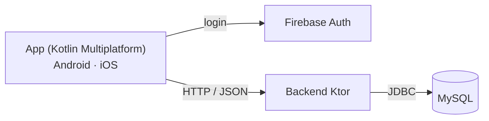

# SmartTool Cabinet

Sistema de gestão de ferramentas para um cenário de manutenção aeronáutica: uma app móvel (Android e iOS) em Kotlin Multiplatform, um backend em Ktor e uma base de dados MySQL.

> Projeto Final de Curso da Licenciatura em Engenharia Informática e Multimédia (LEIM), ISEL.
> Os requisitos, os perfis e os dados são fictícios e foram definidos por nós. O projeto não tem qualquer ligação a uma empresa.

> **TODO:** adicionar screenshots reais da app em `docs/screenshots/` e mostrá-los aqui.

## O problema

Em manutenção aeronáutica, saber que ferramenta está onde, e com quem, é uma questão de rastreabilidade e de segurança. O SmartTool Cabinet regista o que está em cada armário, quem requisitou o quê e o que ainda não foi devolvido, e avisa o gestor quando algo falha.

## Como funciona



1. O utilizador entra com email e password ou com a conta Google (Firebase Authentication).
2. A app pergunta ao backend qual é o cargo desse email e abre o ecrã do perfil correspondente.
3. Todos os dados (ferramentas, armários, requisições, tarefas, histórico) vêm da API do backend, que lê e escreve na base de dados MySQL.

## Perfis

| Perfil | O que faz |
|---|---|
| **Técnico** | Consulta e requisita ferramentas, devolve-as, vê as tarefas que lhe foram atribuídas e o seu histórico. |
| **Gestor** | Atribui tarefas a técnicos, acompanha ferramentas, armários e histórico, e recebe alertas. |
| **Back Office** | Gere utilizadores (cargo, turno, ativar/desativar), armários e consulta o histórico. |

**Alertas** do gestor: ferramentas requisitadas e ainda não devolvidas, e armários destrancados.

## Stack

| Camada | Tecnologia |
|---|---|
| App | Kotlin 2.3, Compose Multiplatform 1.10 (UI partilhada entre Android e iOS), Navigation Compose com rotas tipadas, Ktor Client, kotlinx.serialization |
| Autenticação | Firebase Auth (SDK oficial no Android, GitLive no iOS), Credential Manager para o Google Sign-In |
| Backend | Ktor Server (Netty), Kotlin/JVM 21, JDBC |
| Base de dados | MySQL, com 7 vistas SQL para as consultas mais complexas |

**Arquitetura da app:** MVVM. Cada ecrã tem três ficheiros (`Screen`, `ViewModel`, `UiState`) e o acesso à API está isolado em `RemoteDataSource` por domínio. O que depende da plataforma (URL por omissão do backend, autenticação) fica em `expect`/`actual`, e o resto da app só conhece a interface `AuthRepository`.

## Estrutura do repositório

```
.
├── SmartTool-Cabinet/        # App Kotlin Multiplatform
│   ├── composeApp/           # Código partilhado (commonMain) e específico (androidMain, iosMain)
│   └── iosApp/               # Entrada iOS (projeto Xcode)
├── tap_ktor/                 # Backend Ktor (API REST)
└── MySQL/                    # Scripts SQL: esquema, vistas e dados de exemplo
```

Dentro de `composeApp/src/commonMain`: `core/` (DTOs e acesso à API por domínio), `feature/` (ecrãs por perfil: `gestor`, `tecnico`, `backoffice`, mais login e sessão), `di/`, `ui/` (tema e componentes).

## Modelo de dados

- `funcionario`, com uma tabela por cargo (`gestor`, `tecnico`, `backoffice`) ligada por `id_func`.
- `armazem` e `armario`, com o gestor responsável por cada armário.
- `tipo_ferramenta` e `ferramenta`. Cada ferramenta tem chave composta (código de tipo + número da ferramenta) e um identificador calculado: `idFerramenta = codigo_tipo * 100000 + nFerramenta`. Por exemplo, o tipo `0001` com a ferramenta `00023` dá `000100023`.
- `requisicao` e `requisicao_ferramenta` (o que cada técnico levantou e quando devolveu).
- `tarefa` e `tarefa_ferramenta_permitida` (as ferramentas que uma tarefa autoriza).

## API

| Recurso | Operações |
|---|---|
| `/api/ferramentas` | listar, criar, alterar estado, listar em falta |
| `/api/funcionarios` | listar, obter por email, criar, alterar cargo e turno, desativar |
| `/api/armarios` | listar, listar ferramentas de um armário |
| `/api/requisicoes` | criar, devolver |
| `/api/tarefas` | listar, criar, concluir, listar por técnico |
| `/api/tecnicos` | listar, ferramentas de um técnico, ferramentas reservadas |
| `/api/alertas` | listar |
| `/api/historico` | listar, listar por técnico |

## Como correr

**Pré-requisitos:** Android Studio, JDK 21, MySQL 8 e um projeto Firebase. Para iOS, macOS com Xcode.

### 1. Base de dados

```bash
mysql -u root -p < MySQL/SMARTTOOL.sql
mysql -u root -p smarttool < MySQL/VISTAS.sql
mysql -u root -p smarttool < MySQL/ENTRADAS.sql   # dados de exemplo
```

`MySQL/DROP DATABASE.sql` apaga a base de dados, para recomeçares do zero.

### 2. Backend

O backend lê `DB_USER` (por omissão `root`) e `DB_PASSWORD` do ambiente. O `.env.example` mostra as variáveis, mas o Ktor não lê ficheiros `.env`: define-as no terminal ou na configuração de execução do IDE.

```bash
cd tap_ktor
export DB_PASSWORD=a_tua_password
./gradlew run
```

O servidor fica em `http://localhost:8080` e liga-se a `jdbc:mysql://localhost:3306/smarttool` (ver `src/main/resources/application.yaml`).

### 3. Firebase

O projeto Firebase original já não existe, por isso tens de criar o teu:

1. Na [consola Firebase](https://console.firebase.google.com/), cria um projeto e, em *Authentication*, ativa **Email/Password** e **Google**.
2. **Android:** regista uma app com o package `pfc.a50727a50799.smarttool_cabinet`, adiciona o SHA-1 da tua chave de debug (`./gradlew signingReport`, dentro de `SmartTool-Cabinet/`) e coloca o `google-services.json` em `SmartTool-Cabinet/composeApp/`.
3. **iOS:** regista uma app iOS e coloca o `GoogleService-Info.plist` em `SmartTool-Cabinet/iosApp/iosApp/`.
4. O login só funciona para emails que existam na tabela `funcionario`. Em `ENTRADAS.sql` há 9 funcionários de exemplo (2 gestores, 4 técnicos, 3 back office): cria no Firebase um utilizador com o email de um deles, ou altera o email de um funcionário para o teu.

Nenhum destes ficheiros de configuração deve ser commitado.

### 4. App

Abre `SmartTool-Cabinet/` no Android Studio e corre o módulo `composeApp`, ou, no terminal:

```bash
cd SmartTool-Cabinet
./gradlew :composeApp:assembleDebug
```

No emulador Android, a app chega ao backend em `http://10.0.2.2:8080`, que é o valor por omissão. Num telemóvel real ou no iOS, o backend tem de estar acessível pela rede local: altera o endereço no ecrã inicial da app (campo do servidor) ou o valor por omissão em `AppModule.ios.kt`. Para iOS, abre `SmartTool-Cabinet/iosApp/iosApp.xcodeproj` no Xcode.

## Limitações conhecidas

- **A API não tem autenticação.** O backend não valida os tokens do Firebase: o cargo é obtido a partir do email e qualquer cliente que alcance o servidor pode chamar todos os endpoints. Serve para demonstração em rede local, não para produção.
- A comunicação é em HTTP, sem TLS.
- Cobertura de testes mínima: só existem os testes de exemplo gerados pelos templates.

## Autores

Projeto desenvolvido em dupla por [Luísa Sampaio](https://github.com/lulssam) e [Gonçalo Charneca](https://github.com/gonka2004).
